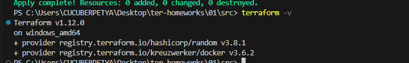
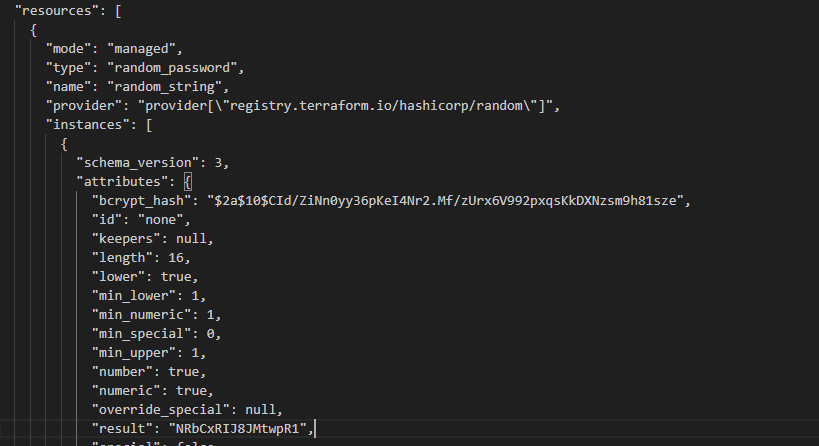
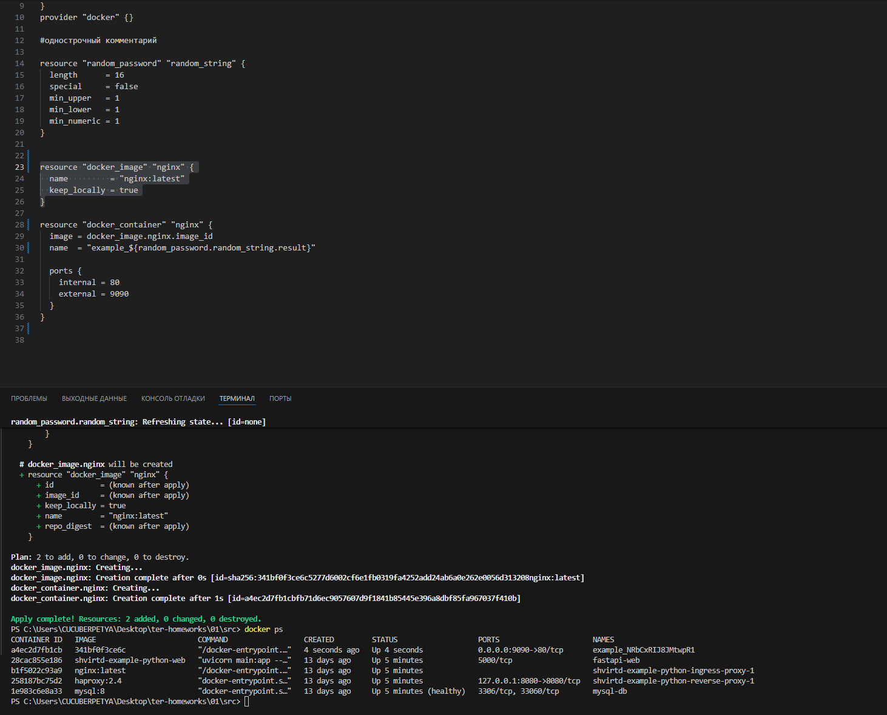
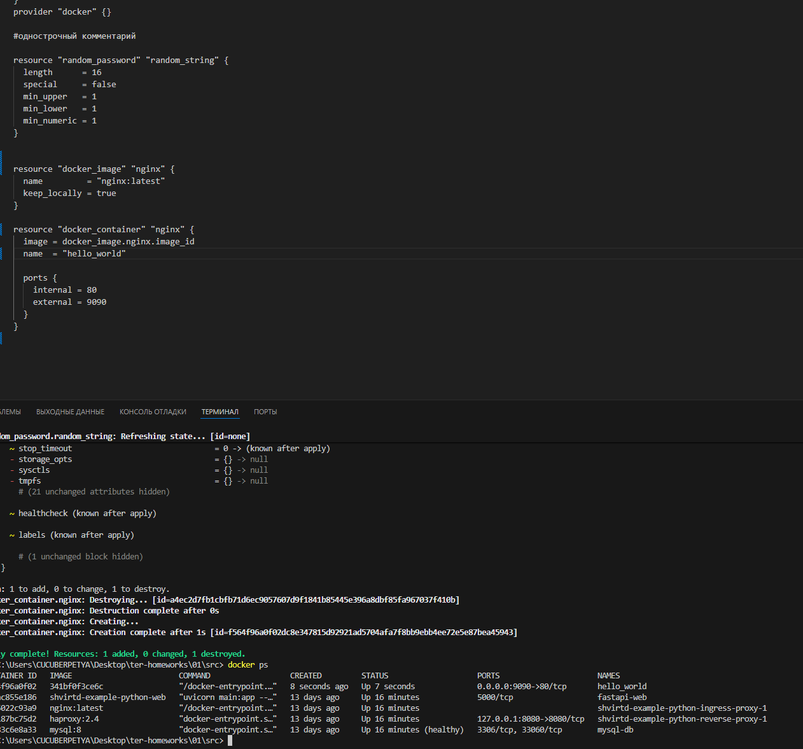
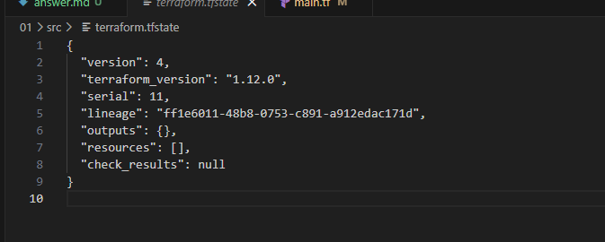
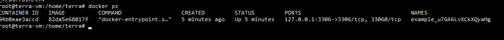
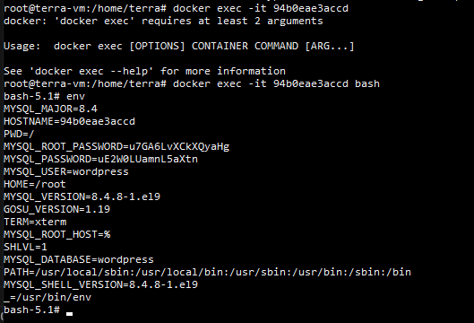

#Задание №1
##01

---

##02
     допустимо хранить личную, секретную информацию в файле personal.auto.tfvars. Этот файл не будет отправлен в git и останется только на локальной машине.

---

##03

---

##04
    Ошибка в name  = "example_${random_password.random_string_FAKE.resulT}. Неверно задано имя "random_string_FAKE", ошибка в атрибуте "resulT"
    resource "docker_container" "1nginx" - изменено на resource "docker_container" "nginx"
    resource "docker_image"  {
    name         = "nginx:latest"
    keep_locally = true
    }
    Добавлено имя "docker_image" "nginx".
    

---

##05
    При применении -auto-approve все изменения происходят без дополнительного подтверждения, в следствии чего, можно не заметить ошибки, или удалить данные или ресурсы.

---

##06

Результат уничтожения созданных ресурсов

---

##07
    Образ был не удален из-за параметра keep_locally = true. 
    keep_locally(Логическое значение) Если true, то образ Docker не будет удален при операции уничтожения. Если false, то образ будет удален из локального хранилища Docker при операции уничтожения.

    Ссылка - https://registry.terraform.io/providers/kreuzwerker/docker/latest/docs/resources/image#keep_locally
---

#Задание №2

##№Вывод контейнера

---
##Вывод env переменных

---

    

